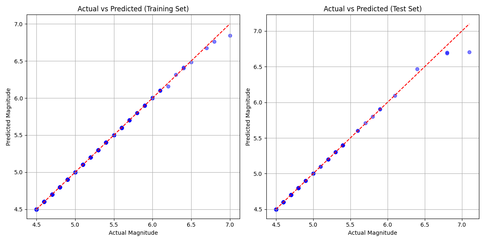
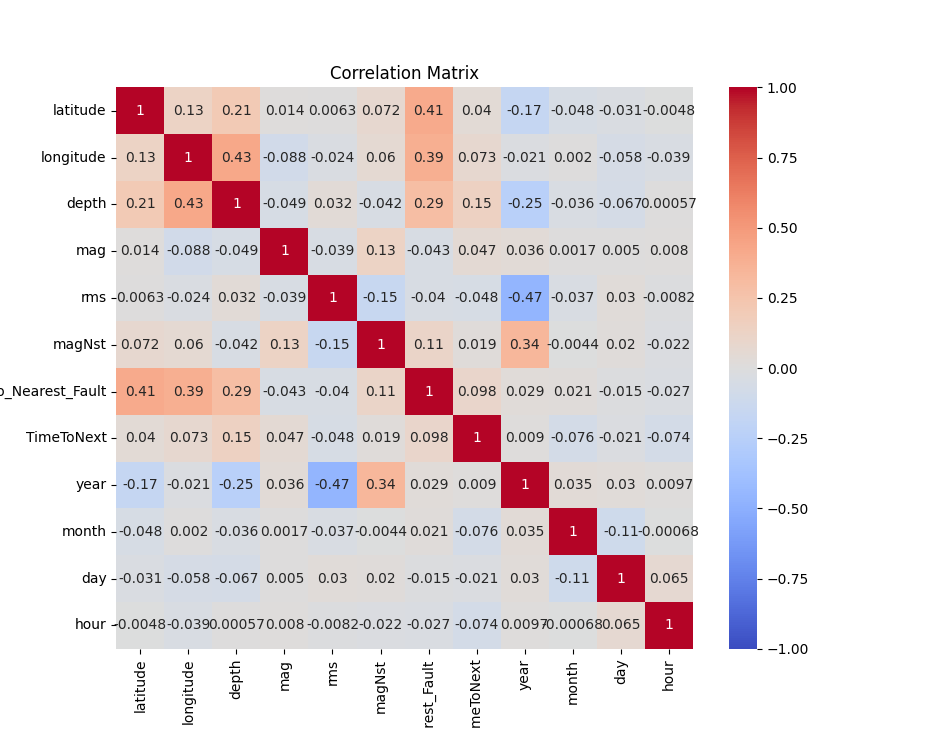
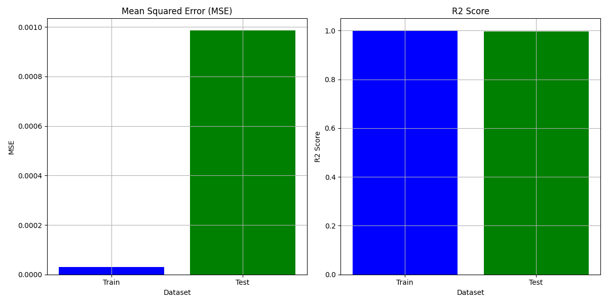

# Earthquake Magnitude Prediction Project

This project aims to predict earthquake magnitudes using machine learning techniques, specifically RandomForestRegressor. The dataset used includes seismic data from Armenia, Turkey, Azerbaijan, Georgia, and Iran

As a resident of Armenia, where recent seismic activity has impacted local communities, I initiated this project to explore predictive models for earthquake magnitudes.

## Dataset Description

The earthquake dataset comprises seismic events recorded in the regions of Armenia, Turkey, Azerbaijan, Georgia, and Iran. It includes attributes such as earthquake magnitude (mag), depth, location coordinates (latitude and longitude), time of occurrence, and various other seismic parameters. Prior to modeling, the dataset undergoes preprocessing steps to handle missing values, normalize features, and derive relevant attributes for predicting earthquake magnitudes.

**Dataset Link**: [USGS Earthquake Dataset](https://earthquake.usgs.gov/earthquakes/search/)

## Project Structure

- **data/**  
  - `earthquake.csv`: Raw earthquake data  
  - `earthquake_processed.csv`: Preprocessed earthquake data  
  - `gem_active_faults_harmonized.geojson`: GeoJSON file of active faults  

- **screenshots/**  
  - `actual_vs_predicted.png`: Plot of Actual vs Predicted magnitudes  
  - `correlation.png`: Correlation matrix plot with target (mag)  
  - `evaluation_metrics.png`: Evaluation metrics plot (train/test)  
  - `region.png`: Screenshot of the region from USGS website  

- **feature_engineering.py**: Script for feature engineering tasks  
- **feature_selection.py**: Script for feature selection tasks  
- **main.py**: Main script to run the project  
- **rf_model.py**: Script containing RandomForestRegressor model  
- **requirements.txt**: List of dependencies  

## Scripts

### `feature_engineering.py`

This script handles feature engineering tasks such as scaling, normalization, and creating new features from the earthquake dataset.

### `feature_selection.py`

The `feature_selection.py` script is responsible for selecting the most relevant features from the dataset to improve model performance.

### `main.py`

The `main.py` script orchestrates the overall workflow of the project, including data loading, model training, evaluation, and visualization.

### `rf_model.py`

`rf_model.py` contains the RandomForestRegressor model implementation using GridSearchCV for hyperparameter tuning and evaluation.

## Model Performance Insights

After training the RandomForestRegressor model using GridSearchCV for hyperparameter tuning, the following insights were derived:

 - The model achieved high accuracy in predicting earthquake magnitudes, with a training MSE of 4.83e-05 and test MSE of 0.0013.
 - Evaluation metrics, including R-squared scores, indicate strong performance on both training (R2 = 0.9997) and test datasets (R2 = 0.994).
 - Key features such as seismic depth, distance to nearest fault lines, and regional seismic activity significantly influence earthquake magnitude predictions.

## Screenshots

### Actual vs Predicted Magnitudes



This plot shows the comparison between actual earthquake magnitudes and predicted magnitudes for both the training and test datasets.

### Correlation Matrix



The correlation matrix illustrates the relationships between different features and the target variable (magnitude).

### Evaluation Metrics



The evaluation metrics plot displays the model performance metrics, including Mean Squared Error (MSE) and R-squared (R2) scores for both training and test datasets.

### Region Screenshot


This screenshot from the USGS website highlights the geographic region of interest for earthquake prediction in Armenia.

## Usage

1. Clone the repository:
   ```bash
   git clone <repository_url>
   cd <repository_name>
   ```

2. Install dependencies:
    ```bash
    pip install -r requirements.txt
    ```

3. Run the project:
    ```bash
    python main.py
    ```

## Contributing

Contributions are welcome! Feel free to submit issues and pull requests.
